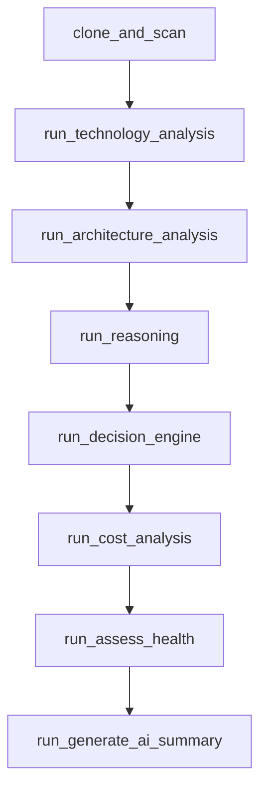

# CloudPilot AI — System Architecture

## 1. System Topology Overview
CloudPilot employs a decoupled three-tier system:
- **Presentation Tier**: A client-side SPA built with React, Vite, Tailwind CSS, Framer Motion, and Recharts.
- **Application Tier**: A FastAPI web server handling request routing, security middleware, SSE streaming log updates, and vector search embeddings.
- **Orchestration Tier**: A multi-stage LangGraph state machine orchestrating repository parsing, technology classifications, architectural reasoning, and pricing engines.

```
+------------------+      HTTPS / API      +------------------+
|    React App     | <-------------------> |   FastAPI App    |
|   (Vite, SPA)    |                       | (JWT, Rate limit)|
+------------------+                       +------------------+
         |                                           |
         v SSE Log Stream                            v
+------------------+                       +------------------+
| EventSource Stream| <--------------------| LangGraph Engine |
| (Real-time logs) |                       | (Stateful Nodes) |
+------------------+                       +------------------+
```

---

## 2. LangGraph State Machine
The core pipeline operates on 8 nodes communicating via state variables:



1. **`clone_and_scan`**: Performs shallow clone of repository and runs heuristic scanner.
2. **`run_technology_analysis`**: Detects languages, package managers, and tech frameworks.
3. **`run_architecture_analysis`**: Audits codebase files and lockfiles, categorizes components (ORM, Auth, Storage), and evaluates bottlenecks.
4. **`run_reasoning`**: Infers operational requirements and compares candidate trade-offs.
5. **`run_decision_engine`**: Runs the dynamic weighted decision matrix, selecting primary compute targets and support dependencies.
6. **`run_cost_analysis`**: Pricing engine; calculates estimated compute, storage, transfer, and DB costs.
7. **`run_assess_health`**: Scores repository cloud readiness and compiles report details.
8. **`run_generate_ai_summary`**: Calls LLM (GPT-4o-mini) to build the concise summary or falls back to heuristics.

---

## 3. RAG Chat Architecture (AI Consultant)
1. **Index Stage**: Walk repository, extract files (`.py`, `.ts`, `.js`, `.go`, `.tf`), chunk code blocks, calculate semantic embeddings (OpenAI `text-embedding-3-small`), and write to vector store.
2. **Retrieve Stage**: Match incoming user chat query against vector index to pull top-K code blocks.
3. **Generation Stage**: Construct system instructions containing code blocks and query, invoke LLM, and stream Markdown response to the panel.
